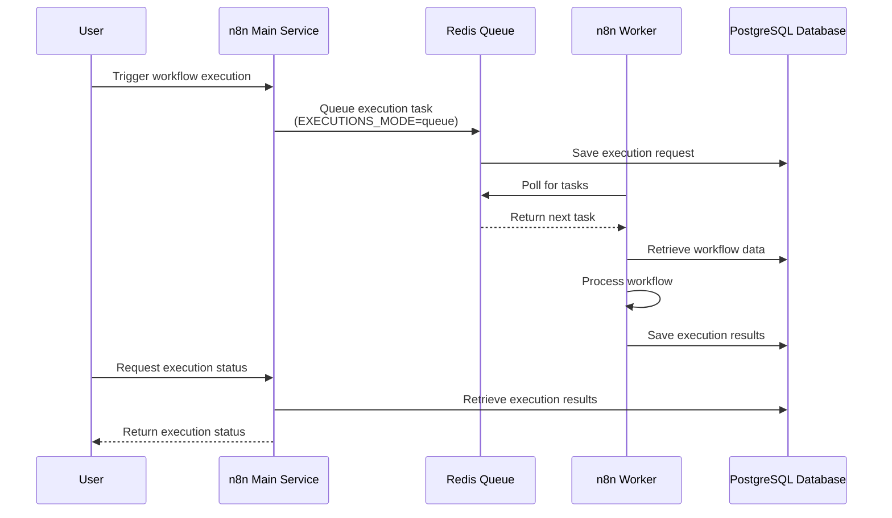
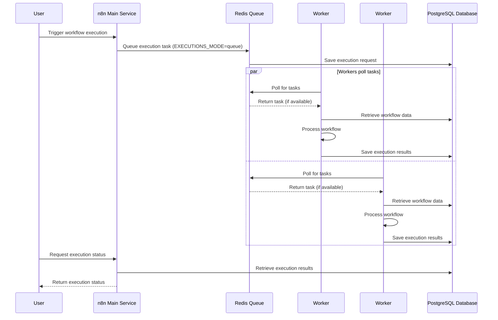

# n8n Queue Mode — Scalable and Reliable Workflow Automation

Unleash the full potential of n8n by running it in **Queue Mode**, where execution is distributed from the main interface to multiple workers via Redis. This setup ensures scalability, responsiveness, and resilience—even under load.

---

## Table of Contents

- [Why Queue Mode?](#why-queue-mode)
- [Architecture Overview](#architecture-overview)
- [Task Processing Flow (Queue Mode)](#task-processing-flow-queue-mode)
- [What is Queue Mode?](#what-is-queue-mode)
- [Configuration](#configuration)
- [Recommended VPS Sizing & Worker Strategy](#recommended-vps-sizing--worker-strategy)
- [Deployment Commands](#deployment-commands)
- [Health check](#health-check)
- [Troubleshooting](#troubleshooting)
  - [UI is slow or unresponsive](#ui-is-slow-or-unresponsive)
  - [Jobs stuck in “Waiting” state](#jobs-stuck-in-waiting-state)
  - [Database connection errors](#database-connection-errors)
  - [Redis errors in logs](#redis-errors-in-logs)
  - [Workflows stop after running a while](#workflows-stop-after-running-a-while)
  - [Backup/restore issues (credentials missing)](#backuprestore-issues-credentials-missing)
  - [Certificates (SSL) not working](#certificates-ssl-not-working)
- [Best Practices, Monitoring, and Scaling](#best-practices-monitoring-and-scaling)
  - [Best Practices for n8n Development](#best-practices-for-n8n-development)
  - [Monitor and Scale](#monitor-and-scale)
  - [Scaling Queue Mode for Larger Deployments](#scaling-queue-mode-for-larger-deployments)

---

##  Why Queue Mode?

- **Scalable Execution**: Offload heavy workflow processing to dedicated worker containers.
- **Responsive UI**: Keep your editor fast and stable regardless of execution load.
- **Reliability**: Workers handle jobs independently—failures won't block the main process.
- **Flexible Deployment**: Horizontally scale workers based on demand.

> Queue Mode works just like orchestration in Kubernetes, batch systems, or load-balanced services.  

---

## Architecture Overview

```text
                   ┌───────────────────┐
                   │   Traefik Proxy   │
                   │ (Routes traffic)  │
                   └─────────┬─────────┘
                             │
                             ▼
                   ┌───────────────────┐
                   │   n8n-Main (UI)   │
                   │  - Editor & API   │
                   │  - Webhooks       │
                   │  - Schedules      │
                   └─────────┬─────────┘
                             │
                             │ Enqueues jobs
                             ▼
                   ┌───────────────────┐
                   │      Redis        │
                   │   (BullMQ Queue)  │
                   └─────────┬─────────┘
                             │
        ┌────────────────────┴────────────────────┐
        │                                         │
        ▼                                         ▼
┌───────────────────┐                   ┌───────────────────┐
│   Worker #1       │                   │   Worker #2       │
│ - Executes jobs   │                   │ - Executes jobs   │
│ - Uses concurrency│                   │ - Uses concurrency│
└─────────┬─────────┘                   └─────────┬─────────┘
          │                                       │
          └──────────────────┬────────────────────┘
                             │
                             ▼
                   ┌───────────────────┐
                   │   Postgres DB     │
                   │ - Workflows       │
                   │ - Executions      │
                   │ - Credentials     │
                   └───────────────────┘
```

## Task Processing Flow (Queue Mode)
- **Case: 1 Worker**
  - All workflow executions are pulled from **Redis** and processed by a single worker container.
  - Concurrency limits how many executions that worker can run in parallel (e.g., `N8N_WORKER_CONCURRENCY=5`).
  - If the worker is busy or crashes, execution throughput is limited.

- **Case: 2 Workers**
  - Both workers poll Redis at the same time.  
  - Redis distributes tasks between them (first come, first served).  
  - This effectively **doubles the processing capacity** (assuming similar concurrency per worker).  
  - If one worker crashes, the other keeps processing, which improves **resilience**.

## What is Queue Mode?

In **single mode**, one n8n container handles **everything** (UI, webhooks, executions). This is fine for small setups, but under load, executions can slow down or block the UI.

**Queue Mode** separates responsibilities:
- **Main (`n8n-main`)** → handles UI, schedules, and webhooks
- **Workers (`n8n-worker`)** → execute workflows (can scale horizontally)
- **Redis** → job queue between main and workers
- **Postgres** → database for workflows, execution history, and credentials

Benefits:
- Horizontal scaling → add workers for more throughput
- Isolated workloads → UI stays responsive even under heavy execution load
- Configurable concurrency → fine-tune how many workflows each worker runs in parallel

---

## Configuration

This setup requires two key files:

- [`.env`](./.env) → Environment variables (domain, credentials, queue settings, Postgres, Redis, etc.)  
- [`docker-compose.yml`](./docker-compose.yml) → Defines services: Traefik, Postgres, Redis, n8n-main, and workers

> 💡 Make sure to replace placeholder values (like `DOMAIN`, `SSL_EMAIL`, `STRONG_PASSWORD`, `N8N_ENCRYPTION_KEY`) with your own before deployment.

## Recommended VPS Sizing & Worker Strategy

| VPS (vCPU / RAM) | Setup Suggestion                   |
|------------------|------------------------------------|
| **1 vCPU / 2 GB**  | 1 worker @ concurrency **3–5**      |
| **2 vCPU / 4 GB**  | 1–2 workers @ concurrency **5**     |
| **4 vCPU / 8 GB**  | 2 workers @ concurrency **8**       |
| **8+ vCPU / 16+ GB** | 3–4 workers @ concurrency **8–10** |

## Deployment Commands

Follow these steps to deploy n8n in **Queue Mode** (Main + Redis + Workers).

---

### 1) Generate strong password and N8N_ENCRYPTION_KEY
Generate and set strong secrets:

```bash
openssl rand -base64 16  # STRONG_PASSWORD
openssl rand -base64 32  # N8N_ENCRYPTION_KEY
```

### 2) Update values in `.env`
  ```env
  DOMAIN=automation.example.com
  SSL_EMAIL=you@example.com
  STRONG_PASSWORD=PASTE_16B       # output of command openssl rand -base64 16 
  N8N_ENCRYPTION_KEY=PASTE_32B    # output of command openssl rand -base64 32, must never change once set
```

### 3) Deploy the stack

```bash
# Validate YAML & env expansion first
docker compose config

# Pull images (optional but recommended)
docker compose pull

# Manual create volume
for v in n8n-data postgres-data redis-data letsencrypt; do docker volume create "$v"; done
docker volume ls | grep -E 'n8n-data|postgres-data|redis-data|letsencrypt'

# Start everything (Traefik, Postgres, Redis, n8n-main, 1 worker)
docker compose up -d

# Scale to 2 workers
docker compose up -d --scale n8n-worker=2
```

## Health check

Run these commands after deployment to verify everything is working:

### n8n-main (UI / API):
```bash
docker exec -it n8n-main sh -lc 'wget --spider -q http://127.0.0.1:5678/healthz && echo "n8n-main OK" || echo FAIL'
```
Should print:
```bash
n8n-main OK
```
###

### Queue mode confirmation:
```bash
docker exec -it n8n-main printenv | grep EXECUTIONS_MODE
```
Should show:
```bash
EXECUTIONS_MODE=queue
```

### Redis (queue backend)
```bash
export QUEUE_BULL_REDIS_PASSWORD=PASTE_16B       # output of command openssl rand -base64 16 
docker compose exec redis redis-cli -a "$QUEUE_BULL_REDIS_PASSWORD" ping
```
Should return:
```nginx
PONG
```
### Postgres (database):
- Test DB from postgres (verify POSTGRES_PASSWORD)
```bash
docker compose exec postgres bash -lc 'PGPASSWORD="$POSTGRES_PASSWORD" psql -h 127.0.0.1 -U n8n -d n8n -c "select 1"'
```
Should return:
```bash
 ?column?
----------
        1
(1 row)
```
- List DB
```bash
docker compose exec postgres psql -U n8n -d n8n -c "\dt"
```
Should return a list of tables. If empty, that’s fine on first boot — tables will appear after you create workflows.
```bash
                 List of relations
 Schema |            Name            | Type  | Owner
--------+----------------------------+-------+-------
 public | annotation_tag_entity      | table | n8n
 public | auth_identity              | table | n8n
 public | auth_provider_sync_history | table | n8n
 public | credentials_entity         | table | n8n
 public | event_destinations         | table | n8n
 public | execution_annotation_tags  | table | n8n
 public | execution_annotations      | table | n8n
 public | execution_data             | table | n8n
 public | execution_entity           | table | n8n
 public | execution_metadata         | table | n8n
 public | folder                     | table | n8n
 public | folder_tag                 | table | n8n
 public | insights_by_period         | table | n8n
 public | insights_metadata          | table | n8n
 public | insights_raw               | table | n8n
 public | installed_nodes            | table | n8n
 public | installed_packages         | table | n8n
 public | invalid_auth_token         | table | n8n
 public | migrations                 | table | n8n
 public | processed_data             | table | n8n
 public | project                    | table | n8n
 public | project_relation           | table | n8n
 public | settings                   | table | n8n
 public | shared_credentials         | table | n8n
 public | shared_workflow            | table | n8n
 public | tag_entity                 | table | n8n
 public | test_case_execution        | table | n8n

```
### Traefik TLS:
```bash
curl -I https://$DOMAIN   # Expect 200/302 and valid certificate
```
Example logs:
```bash
root@ubuntu-s-1vcpu-1gb-sgp1-01:~/n8n-main/queue-mode# curl -I https://n8n.yourdomain.com
HTTP/2 200
accept-ranges: bytes
cache-control: public, max-age=86400
content-type: text/html; charset=utf-8
date: Tue, 19 Aug 2025 15:02:33 GMT
etag: W/"3ec-198c2d3b96d"
last-modified: Tue, 19 Aug 2025 14:55:12 GMT
strict-transport-security: max-age=315360000; includeSubDomains; preload
vary: Accept-Encoding
vary: Accept-Encoding
x-content-type-options: nosniff
x-xss-protection: 1; mode=block
content-length: 1004
```

### Worker connectivity
- List all running containers:
```bash
docker compose ps --format "table {{.Names}}\t{{.Status}}"
```
You will see logs:
```bash
docker compose ps --format "table {{.Names}}\t{{.Status}}"
<no value>                     STATUS
n8n-main                       Up 2 minutes (healthy)
postgres                       Up 2 minutes (healthy)
queue-mode-n8n-runner-main-1   Up 2 minutes
queue-mode-n8n-worker-1        Up 2 minutes
queue-mode-n8n-worker-2        Up 2 minutes
redis                          Up 2 minutes (healthy)
traefik                        Up 2 minutes (healthy)

```

- Check container logs n8n-main
```bash
docker compose logs -f n8n-main
```
You will see logs:
```bash
Initializing n8n process
n8n ready on ::, port 5678
n8n Task Broker ready on 0.0.0.0, port 5679
[license SDK] Skipping renewal on init: license cert is not initialized
Version: 1.107.3

Editor is now accessible via:
https://n8n.yourdomain.com
```

- Check container logs for n8n-runner-main
```bash
docker compose logs -f n8n-runner-main
```
```bash
root@ubuntu-s-1vcpu-1gb-sgp1-01:~/n8n-main/queue-mode# docker compose logs -f n8n-runner-main
n8n-runner-main-1  | 2025/08/19 16:22:54 INFO  Starting launcher...
n8n-runner-main-1  | 2025/08/19 16:22:54 INFO  Waiting for task broker to be ready...
n8n-runner-main-1  | 2025/08/19 16:22:54 INFO  Starting launcher's health check server at port 5680

```
- Check log workers
```bash
# Worker 1
docker logs -f queue-mode-n8n-worker-2

# Worker 2
docker logs -f queue-mode-n8n-worker-1

# Streams logs from all scaled worker containers in one view (very useful to see load balancing in action).
docker compose logs -f n8n-worker
```
You will see logs:
```bash
root@ubuntu-s-1vcpu-1gb-sgp1-01:~/n8n-main/queue-mode# docker compose logs -f n8n-worker
n8n-worker-2  | n8n Task Broker ready on 0.0.0.0, port 5679
n8n-worker-2  | [license SDK] Skipping renewal on init: renewOnInit is disabled in config
n8n-worker-2  | [license SDK] Skipping renewal on init: autoRenewEnabled is disabled in config
n8n-worker-2  | [license SDK] Skipping renewal on init: license cert is not initialized
n8n-worker-2  |
n8n-worker-2  | n8n worker is now ready
n8n-worker-2  |  * Version: 1.107.3
n8n-worker-2  |  * Concurrency: 5
n8n-worker-2  |
n8n-worker-2  |
n8n-worker-2  | n8n worker server listening on port 5678
n8n-worker-1  | n8n Task Broker ready on 0.0.0.0, port 5679
n8n-worker-1  | [license SDK] Skipping renewal on init: renewOnInit is disabled in config
n8n-worker-1  | [license SDK] Skipping renewal on init: autoRenewEnabled is disabled in config
n8n-worker-1  | [license SDK] Skipping renewal on init: license cert is not initialized
n8n-worker-1  |
n8n-worker-1  | n8n worker is now ready
n8n-worker-1  |  * Version: 1.107.3
n8n-worker-1  |  * Concurrency: 5
n8n-worker-1  |
n8n-worker-1  |
n8n-worker-1  | n8n worker server listening on port 5678
```

- Check log for Redis
```bash
docker logs -f redis
```
You will see logs:
```bash
root@ubuntu-s-1vcpu-1gb-sgp1-01:~/n8n-main/queue-mode# docker logs -f redis
1:C 19 Aug 2025 16:22:46.321 # WARNING Memory overcommit must be enabled! Without it, a background save or replication may fail under low memory condition. Being disabled, it can also cause failures without low memory condition, see https://github.com/jemalloc/jemalloc/issues/1328. To fix this issue add 'vm.overcommit_memory = 1' to /etc/sysctl.conf and then reboot or run the command 'sysctl vm.overcommit_memory=1' for this to take effect.
1:C 19 Aug 2025 16:22:46.322 * oO0OoO0OoO0Oo Redis is starting oO0OoO0OoO0Oo
1:C 19 Aug 2025 16:22:46.322 * Redis version=7.4.5, bits=64, commit=00000000, modified=0, pid=1, just started
1:C 19 Aug 2025 16:22:46.322 * Configuration loaded
1:M 19 Aug 2025 16:22:46.322 * monotonic clock: POSIX clock_gettime
1:M 19 Aug 2025 16:22:46.325 * Running mode=standalone, port=6379.
1:M 19 Aug 2025 16:22:46.326 * Server initialized
1:M 19 Aug 2025 16:22:46.326 * Loading RDB produced by version 7.4.5
1:M 19 Aug 2025 16:22:46.326 * RDB age 183 seconds
1:M 19 Aug 2025 16:22:46.326 * RDB memory usage when created 1.27 Mb
1:M 19 Aug 2025 16:22:46.326 * Done loading RDB, keys loaded: 0, keys expired: 1.
1:M 19 Aug 2025 16:22:46.326 * DB loaded from disk: 0.000 seconds
1:M 19 Aug 2025 16:22:46.326 * Ready to accept connections tcp
```

- Check log for Postgres
```bash
docker logs -f postgres
```
You will see logs:
```bash
root@ubuntu-s-1vcpu-1gb-sgp1-01:~/n8n-main/queue-mode# docker logs -f postgres

PostgreSQL Database directory appears to contain a database; Skipping initialization

2025-08-19 16:22:46.689 UTC [1] LOG:  starting PostgreSQL 14.19 (Debian 14.19-1.pgdg13+1) on x86_64-pc-linux-gnu, compiled by gcc (Debian 14.2.0-19) 14.2.0, 64-bit
2025-08-19 16:22:46.689 UTC [1] LOG:  listening on IPv4 address "0.0.0.0", port 5432
2025-08-19 16:22:46.690 UTC [1] LOG:  listening on IPv6 address "::", port 5432
2025-08-19 16:22:46.695 UTC [1] LOG:  listening on Unix socket "/var/run/postgresql/.s.PGSQL.5432"
2025-08-19 16:22:46.704 UTC [25] LOG:  database system was shut down at 2025-08-19 16:19:43 UTC
2025-08-19 16:22:46.724 UTC [1] LOG:  database system is ready to accept connections

```

## Troubleshooting

Even with Queue Mode properly configured, you may encounter issues. This section covers the **most common problems** and how to fix them.

---

### UI is slow or unresponsive
- **Cause**: Workflows running inside the main container instead of workers, or workers not connected.  
- **Fix**:
  1. Confirm queue mode:
     ```bash
     docker exec -it n8n-main printenv | grep EXECUTIONS_MODE
     ```
     Should return `EXECUTIONS_MODE=queue`.
  2. Check worker logs:
     ```bash
     docker compose logs -f n8n-worker
     ```
     Look for: `Connected to Redis`.
  3. If workers are missing → scale up:
     ```bash
     docker compose up -d --scale n8n-worker=2
     ```

---

### Jobs stuck in “Waiting” state
- **Cause**: Workers not pulling jobs from Redis.  
- **Fix**:
  - Check Redis health:
    ```bash
    docker compose exec redis redis-cli ping
    ```
    Should reply: `PONG`.
  - If using Redis password, make sure it matches in `.env` (`QUEUE_BULL_REDIS_PASSWORD`) **and** `docker-compose.yml` (with `--requirepass`).
  - Restart workers:
    ```bash
    docker compose restart n8n-worker
    ```

---

### Database connection errors
- **Cause**: Postgres not healthy, wrong credentials, or insufficient resources.  
- **Fix**:
  1. Verify Postgres is running:
     ```bash
     docker compose exec postgres pg_isready -U n8n
     ```
  2. Test DB access:
     ```bash
     docker compose exec postgres psql -U n8n -d n8n -c "\dt"
     ```
     Should return tables (may be empty if new).
  3. Check `.env` → `DB_POSTGRESDB_USER`, `DB_POSTGRESDB_PASSWORD`, `POSTGRES_USER`, `POSTGRES_PASSWORD` must match.

---

### Redis errors in logs
- **Cause**: Password mismatch or Redis crash.  
- **Fix**:
  - If you enabled `--requirepass` in `docker-compose.yml`, keep `QUEUE_BULL_REDIS_PASSWORD` in `.env`.
  - If you don’t want Redis auth, remove both.  
  - Restart Redis:
    ```bash
    docker compose restart redis
    ```

---

### Workflows stop after running for a while
- **Cause**: Worker concurrency is too high for VPS resources.  
- **Fix**:
  - Lower concurrency in `.env`:
    ```env
    N8N_WORKER_CONCURRENCY=3
    ```
  - Or add more workers:
    ```bash
    docker compose up -d --scale n8n-worker=3
    ```
  - Rule of thumb: scale **workers** before raising concurrency too high.

---

### Backup/restore issues (credentials missing)
- **Cause**: Missing or changed `N8N_ENCRYPTION_KEY`.  
- **Fix**:
  - Always ensure `.env` contains the same `N8N_ENCRYPTION_KEY` used during install.
  - If lost, old credentials cannot be recovered.

---

### Certificates (SSL) not working
- **Cause**: Traefik can’t validate Let’s Encrypt challenge.  
- **Fix**:
  - Confirm `DOMAIN` in `.env` resolves to your VPS public IP.
  - Check Traefik logs:
    ```bash
    docker logs -f traefik
    ```
  - Port 80/443 must be open on firewall/cloud.

---

## Best Practices, Monitoring, and Scaling

### Best Practices for n8n Development
- Keep workflows modular and avoid unnecessary loops or long-running tasks.
- Test new workflows with **manual executions** before scaling them out to workers.
- Use **environment variables** to store sensitive information instead of hardcoding credentials.
- Regularly prune old execution data (set `EXECUTIONS_DATA_PRUNE=true`) to keep the database lean.
- Always back up:
  - Postgres database (workflow definitions + credentials)
  - `.env` file (especially `N8N_ENCRYPTION_KEY`)
  - Redis data (optional, if you want queue persistence)

---

### Monitor and Scale

It’s important to **monitor your queue mode setup** so it doesn’t bottleneck under load.

- **Server Metrics**
  - Use `htop` or your VPS panel to monitor CPU and memory.
  - Run `docker stats` to check individual container performance.

- **Redis Monitoring**
  - Use `redis-cli info memory` or `redis-cli info stats` to track memory and queue usage.
  - Optionally run **Redis Commander** for a visual UI.

- **Database Monitoring**
  - Keep an eye on Postgres growth.
  - Monitor execution times and failed workflows.

- **Application Monitoring**
  - n8n UI → Settings → Executions shows active and past jobs.
  - For advanced monitoring, integrate **Prometheus + Grafana** to visualize queue size, worker load, and execution times.

---

### Scaling Queue Mode for Larger Deployments

When your workload grows, plan for scaling:

- Run **multiple workers** pointing to the same Redis instance.  
- Use **Redis clustering** or managed Redis (e.g., AWS ElastiCache, Azure Cache) for high availability.  
- Scale **Postgres vertically** (more CPU/RAM) or move to a managed DB service for reliability.  
- Split workflows into **different queues** if you have very different workload types (e.g., critical vs. batch jobs).  
- Automate scaling with **Kubernetes** or **Docker Swarm**, letting the orchestrator add/remove workers dynamically.  
